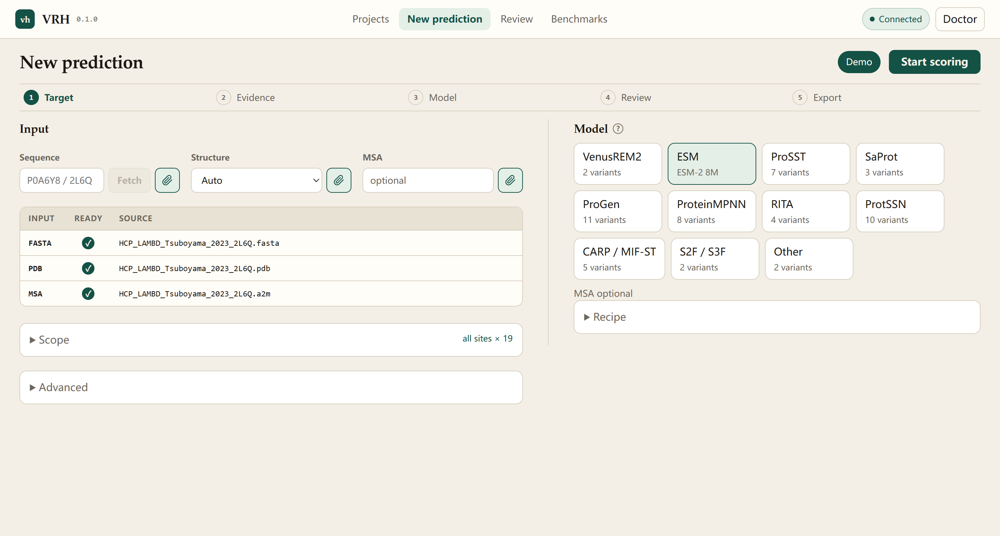
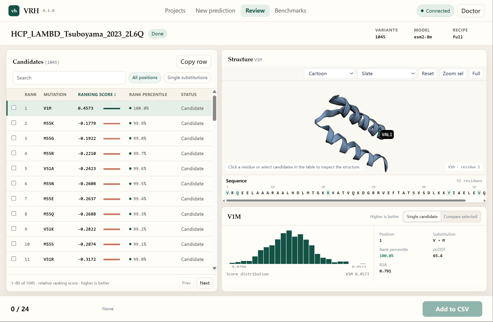
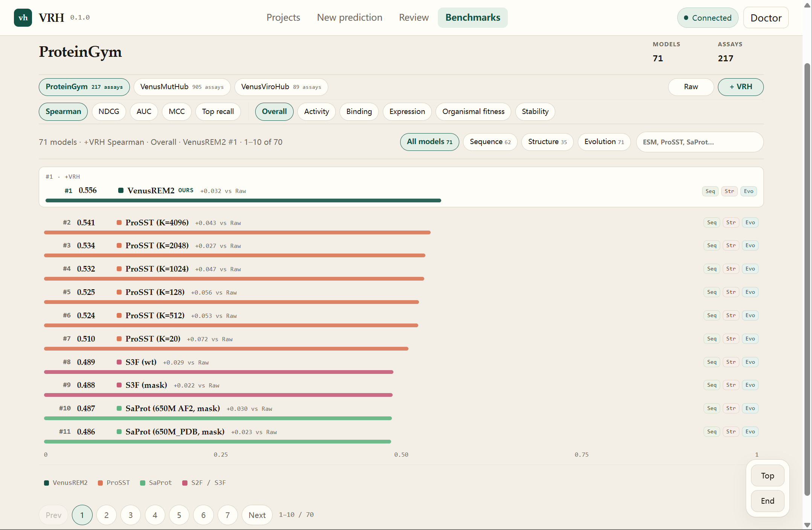

# REM-Harness

[](pyproject.toml)
[](LICENSE)


A General Harness for Protein Foundation Model Fitness Prediction

**REM-Harness** (`vrh` / `remharness`) is a frozen-PLM readout that recalibrates substitution scores (no fine-tuning).

- Calibrate any frozen PLM (ESM-2, SaProt, ProSST, ProteinMPNN, …).
- Score substitution mutants from FASTA, PDB, or a dataset directory.
- Select top-ranked variants in a local dashboard preview.

| Name | Description |
|------|-------------|
| **vrh** | Calibration recipe. Applies to ESM-2, SaProt, ProSST, ProteinMPNN, … CLI: `vrh` / `remharness`. |
| **VenusREM2** | vrh on the six official ProSST checkpoints (`--model venusrem2`). |

Python import: `vrh`. Default backbone: ESM-2 650M.

> [!NOTE]
> vrh scores are for ranking, not ΔΔG. Experimental validation is required
> before any wet-lab decision. The dashboard is a local preview and may change.

## Installation

vrh does **not** depend on PyTorch in `pyproject.toml`. That keeps pip / uv from replacing a working CUDA wheel with the CPU build on PyPI. Bring your own `torch>=2.1` from [pytorch.org](https://pytorch.org/get-started/locally/). ESM-2 650M needs about ≥10 GB VRAM; `vrh demo` (ESM-2 8M) can run on CPU.

`pip install vrh` is CLI + dashboard (`remharness` is an alias). Other deps use lower bounds only. Backbone stacks (ProSST, S3F, CARP, ESM-3) stay opt-in.

**Existing env** (torch already installed), from this repository:

```bash
pip install -e .
# or: uv pip install -e .
vrh doctor          # or: remharness doctor
```

**New env** — install a CUDA torch first, then vrh:

```bash
pip install torch --index-url https://download.pytorch.org/whl/cu124   # pick your CUDA
pip install -e .
vrh demo
vrh dashboard
```

`[cli]`, `[dashboard]`, and `[all]` are aliases of that default. They do **not** pull extra backbones.

```bash
# when you actually use that model — these extras can clash with a custom torch
pip install -e ".[prosst]"    # VenusREM2 / ProSST (torch-geometric / torch-scatter)
pip install -e ".[s3f]"       # S3F / S2F (Python <3.11)
pip install -e ".[carp]"
pip install -e ".[esm3]"
```

If `torch-geometric` is already in the env, use `pip install -e ".[prosst]" --no-deps` or skip the extra.

| Extra | Use |
|-------|-----|
| (core) / `[all]` | ESM-2 scoring, `vrh` CLI, local dashboard |
| `[cli]` / `[dashboard]` / `[recommended]` | aliases of the default install |
| `[prosst]` | VenusREM2 / ProSST (install when you use `--model venusrem2`) |
| `[carp]`, `[esm3]`, `[s3f]` | other backbones (`[s3f]`: Python &lt; 3.11) |
| `[dev]` | pytest / ruff |

## Quick start

### 1. Check the install, then run the demo

```bash
vrh doctor
vrh demo
```

`vrh doctor` reports torch, extras, and cache. `vrh demo` scores a bundled ProteinGym assay with ESM-2 8M.

### 2. Score mutants from the CLI or Python

```bash
# single protein
vrh --fasta prot.fasta --mutants mutants.csv
vrh --fasta prot.fasta --mutants mutants.csv --pdb prot.pdb

# SaProt / ProSST / VenusREM2: PDB is enough (sequence is read from the structure)
vrh --model saprot --pdb prot.pdb --mutants mutants.csv
vrh --model prosst-2048 --pdb prot.pdb --mutants mutants.csv

# single-site saturation (omit --mutants)
vrh --fasta prot.fasta
vrh --model saprot --pdb prot.pdb

# dataset
vrh --base_dir data/my_assay
vrh --model venusrem2 --base_dir data/proteingym_v1
```

```python
from vrh import score

df = score("prot.fasta", mutants="mutants.csv", pdb="prot.pdb")
df = score(pdb="prot.pdb", mutants="mutants.csv", model="saprot")
summary = score(base_dir="data/my_assay")
```

Outputs (default `result/`):

```
result/scores/<protein>.csv    # mutants + vrh column
result/summary_performance.csv # Spearman vs DMS_score, if present
result/run_meta.json
```

Score column: `{backbone}__vrh` (e.g. `esm2_t33_650M_UR50D__vrh`). VenusREM2 writes per-K columns plus a z-mean `VenusREM2`. Higher = more preferred by the calibrated model. Use for ranking; this is not a ΔΔG.

### 3. Open the local dashboard

```bash
vrh dashboard
```

Opens a local console at http://127.0.0.1:8765. This is a preview, not a hosted service. Included in `pip install vrh`.

## Dashboard

Local predict / select / benchmark console (preview) at http://127.0.0.1:8765.

```bash
vrh dashboard
```

Typical loop:

1. **New prediction** — FASTA, PDB, and optional MSA. Paste a UniProt / PDB id and **Fetch**, or upload files. **Demo** loads the bundled 2L6Q assay.
2. **Review** — ranked table, 3D structure, and per-residue evidence. Tick variants and export a CSV shortlist.
3. **Benchmarks** — ProteinGym paired raw vs +vrh (MutHub / ViroHub when those tables are present). Filter by metric, property, and input type.

<p align="center"></p>

**New prediction.** Sequence / structure / MSA on the left; model family on the right. The checklist ticks FASTA, PDB, and MSA once a file is uploaded or an id is fetched.

<p align="center"></p>

**Review.** Ranked candidates next to a PyMOL-style viewer. Crystal PDBs have no pLDDT (B-factor is a temperature factor); fetch an AFDB model to color by confidence.

<p align="center"></p>

**Benchmarks.** Same-backbone raw vs +vrh bars. Scores rank variants; they are not ΔΔG.

CLI scoring still writes `result/scores/`. Dashboard sessions keep working files under `~/.cache/vrh/dashboard`. Extra backbones still need their extras (`[prosst]`, `[s3f]`, …).

## Data

**Single protein.** Mutants CSV needs a `mutant` column (`A42G`; multi-site `A42G:L10M`). Optional `DMS_score` is only for Spearman. SaProt / ProSST / VenusREM2 can take `--pdb` without `--fasta`.

**Dataset** (`--base_dir`):

```
data/my_assay/
  substitutions/         # mutant CSV
  aa_seq/                # optional if pdbs/ is present
  pdbs/
  aa_seq_aln_a2m_af2cf/  # MSA (optional)
  struc_seq/             # optional; built from pdbs/ if missing
```

**Downloads.** ProteinGym substitutions and AF2 PDBs fall back to official ProteinGym v1.3. Extra Hugging Face dataset mirrors are optional (`VRH_HF_DATA_REPOS`). Private repos: `HF_TOKEN` or `hf auth login`. Weights: `~/.cache/vrh/weights` or `$VRH_CACHE`.

```bash
vrh download                 # ProteinGym → data/proteingym_v1
vrh download VenusMutHub
vrh download ViroHub
vrh download benchmark-all
vrh download example
vrh download esm2
vrh download venusrem2
vrh download model-all
```

**Structures.** RSA from any PDB. pLDDT uses the B-factor on predicted models only (AlphaFold / ColabFold / ESMFold).

**Combinatorial libraries.** Double/triple mutants need an explicit site list. Libraries larger than `--max_mutants` (default 1e6) are refused.

```bash
vrh --fasta prot.fasta --pdb prot.pdb \
    --mutant_sites 1,2,3 --positions 10,11,12,13,14
```

## Method

Default recipe (all terms on when the files exist):

1. **MSA fusion** — mix column frequencies into the logits. α is **dynamic** (entropy-adaptive per protein; `--alpha entropy`). No MSA → α = 0. Compute fail → α = 0.8, β = 0.2. `--alpha 0.8` is the fixed-blend ablation.
2. **CCD** — z-score AA background on raw logits, gated by `bg_scale = max(0, bg_consistency)`; β = 1 − α.
3. **RSA** — down-weight solvent-exposed positions (stability-like assays). `--task_type surface` reverses the sign (binding / surface phenotypes).
4. **pLDDT** — down-weight low-confidence predicted structure. Skipped on experimental PDBs.

Scoring mode: `calibrated_margin`. Formula: [`docs/scoring_formula.md`](docs/scoring_formula.md). Forwards (`wt` / `mask` / `tf`): [`docs/models.md`](docs/models.md).

Raw PLM baseline (no vrh extras):

```bash
vrh --fasta prot.fasta --mutants m.csv --alpha 0 --scoring_mode log_odds \
    --no_rsa_decay --no_plddt_decay --background_weight 0
```

Reuse one forward pass across heads:

```bash
CACHE="--logits_cache_dir cache/esm2 --reuse_logits_cache --write_logits_cache --logits_cache_tag esm2_v1"
vrh --base_dir data/my_assay $CACHE --out_scores_dir result/raw --alpha 0
vrh --base_dir data/my_assay $CACHE --out_scores_dir result/vrh
```

## Models

`vrh --list-models` lists backbones. ESM-2 650M is ~2.5 GB on first download.

`--scoring_strategy`: `wt` (default), `mask`, or `tf` (ProteinMPNN). ProSST / VenusREM2 are wt only.

| `--model` | Backbone | Requirements |
|-----------|----------|--------------|
| `venusrem2` | official ProSST ensemble (K=20/128/512/1024/2048/4096) | `struc_seq/` + `[prosst]` |
| `prosst`, `prosst-20`, `prosst-128`, `prosst-512`, `prosst-1024`, `prosst-2048`, `prosst-4096` | single ProSST-K (aliases: `prosst_k4096`, …) | `struc_seq/` + `[prosst]` |
| `esm2` | ESM-2 650M (default). Also `esm2-8m`, `esm2-35m`, `esm2-150m`, `esm2-3b` | FASTA |
| `esm1b`, `esm1v` | ESM-1b; ESM-1v 5-seed | FASTA |
| `saprot`, `saprot-35m-af2`, `saprot-650m-pdb` | SaProt AF2 650M / 35M / PDB 650M | PDB (Foldseek on first use) |
| `carp`, `carp-600k`, `carp-38m`, `carp-76m` | CARP-640M (default) and smaller Zenodo checkpoints | FASTA + `[carp]` |
| `esm3`, `esmc`, `esmc-600m` | ESM3 small / ESM-C 300M / 600M | FASTA + `[esm3]` |
| `protssn`, `protssn-ensemble` | ProtSSN 9-model ensemble. Singles: `protssn-k20-h512` (k=10/20/30 × h=512/768/1280) | PDB |
| `s3f` | S3F | PDB + `[s3f]` |
| `esm_if`, `esmif`, `mifst` | ESM-IF1; MIF-ST | PDB (`[carp]` for MIF-ST) |
| `protein_mpnn`, `proteinmpnn-020` | ProteinMPNN `v_48_020` (tf). Also `proteinmpnn-002` / `010` / `030` and `proteinmpnn-soluble-*` | PDB |
| `progen2`, `progen2-s`, `progen2-m`, `progen2-b`, `progen2-xl` | ProGen2 (default L) | FASTA |
| `progen3`, `progen3-112m`, `progen3-219m`, `progen3-339m`, `progen3-762m`, `progen3-3b` | ProGen3 (default 1B) | FASTA |
| `rita`, `rita-s`, `rita-m`, `rita-l` | RITA (default XL) | FASTA |
| `auto` | any Hugging Face masked LM | `--model_id` |

ProSST does not read a raw PDB; it needs precomputed structure tokens. Inverse-folding and causal LMs cannot use `--scoring_strategy masked-marginals`.

| Flag | Default |
|------|---------|
| `--model` | `esm2` |
| `--scoring_strategy` | `wt-marginals` (`masked-marginals` on MASK=yes models) |
| `--alpha` | `entropy` (dynamic α, per protein) |
| `--background_weight` | `one_minus_alpha` (β = 1 − α) |
| `--scoring_mode` | `calibrated_margin` |
| `--calibrate_on_raw` | on (CCD on raw logits; coherence gate on) |
| `--rsa_decay_mode` / `--plddt_decay_mode` | `above_mean` |
| `--task_type` | `default` |
| `--out_scores_dir` | `result` |
| `--no_auto_download` | off (download if missing) |

`--disable_adaptive_ccd` turns the coherence gate off (`bg_scale = 1`). `--no_rsa_decay` / `--no_plddt_decay` drop those terms. ProteinGym ablation stages:

```bash
# raw
vrh --alpha 0 --scoring_mode log_odds --background_weight 0 --no_rsa_decay --no_plddt_decay
# + MSA (dynamic α)
vrh --alpha entropy --scoring_mode log_odds --background_weight 0 --no_rsa_decay --no_plddt_decay
# + MSA + gated CCD
vrh --no_rsa_decay --no_plddt_decay
# full vrh (package default)
vrh
```

Offline: `--no_auto_download`. All flags: `vrh --help`.

## ProteinGym (217 proteins)

Default: dynamic α, β = 1 − α, `calibrated_margin`. `--alpha 0.8` is a fixed-blend ablation.

### VenusREM2 (ProSST ensemble)

| Variant | Scoring | Alpha | RSA | pLDDT | Mean Spearman |
|---------|---------|-------|-----|-------|---------------|
| Raw backbone | log_odds | — | - | - | 0.524 |
| + MSA | log_odds | dynamic | - | - | 0.542 |
| + MSA + CCD | calibrated_margin | dynamic | - | - | 0.550 |
| + MSA + CCD + RSA | calibrated_margin | dynamic | above_mean | - | 0.554 |
| **Full vrh** | calibrated_margin | dynamic | above_mean | above_mean | **0.556** |

### vrh on ESM-2 (650M, wt-marginals)

| Variant | Scoring | Alpha | RSA | pLDDT | Mean Spearman |
|---------|---------|-------|-----|-------|---------------|
| Raw backbone | log_odds | — | - | - | 0.418 |
| + MSA | log_odds | dynamic | - | - | 0.429 |
| + MSA + CCD | calibrated_margin | dynamic | - | - | 0.440 |
| + MSA + CCD + RSA | calibrated_margin | dynamic | above_mean | - | 0.465 |
| **Full vrh** | calibrated_margin | dynamic | above_mean | above_mean | **0.468** |

### vrh on SaProt (AF-650M, wt-marginals)

| Variant | Scoring | Alpha | RSA | pLDDT | Mean Spearman |
|---------|---------|-------|-----|-------|---------------|
| Raw backbone | log_odds | — | - | - | 0.424 |
| + MSA | log_odds | dynamic | - | - | 0.427 |
| + MSA + CCD | calibrated_margin | dynamic | - | - | 0.433 |
| + MSA + CCD + RSA | calibrated_margin | dynamic | above_mean | - | 0.452 |
| **Full vrh** | calibrated_margin | dynamic | above_mean | above_mean | **0.454** |

### vrh on ESM-1v (5-seed, wt-marginals)

| Variant | Scoring | Alpha | RSA | pLDDT | Mean Spearman |
|---------|---------|-------|-----|-------|---------------|
| Raw backbone | log_odds | — | - | - | 0.410 |
| + MSA | log_odds | dynamic | - | - | 0.419 |
| + MSA + CCD | calibrated_margin | dynamic | - | - | 0.433 |
| + MSA + CCD + RSA | calibrated_margin | dynamic | above_mean | - | 0.455 |
| **Full vrh** | calibrated_margin | dynamic | above_mean | above_mean | **0.457** |

## Development

```bash
pip install -e ".[dev]"
pip install -e ".[prosst,dev]"    # if you also test VenusREM2
pytest test/ -v
```

Dashboard tests live in `test/test_dashboard.py` and `test/test_dashboard_flows.py`.

**Package build.** Bump `version` in `pyproject.toml` and `vrh/__init__.py` together, then:

```bash
python -m build
```

A TestPyPI dry run: `python -m build && twine upload --repository testpypi dist/*`.

## Citation

Please cite this work as:

```bibtex
@article{anonymous2026remharness,
    title={A General Harness for Protein Foundation Model Fitness Prediction},
}
```

## License

Academic, non-profit, and government research: free under the [REM-Harness Academic License](LICENSE). Commercial or fee-for-service use needs a separate license — contact omitted for double-blind review.

Computational scores are for ranking only and are not a substitute for wet-lab validation. Experimental confirmation is required before any laboratory or clinical use.
